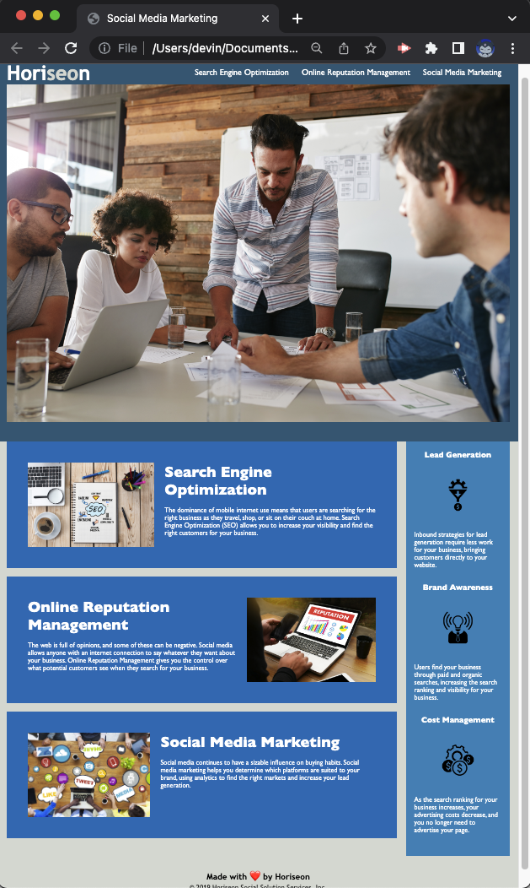

# Challenge 1 - Accessibility
Refactor existing code in order to meet accessibility standards.


# Description
- Studied the existing code to understand all working parts 
- Refactored code by organizing all working parts in both the HTML and CSS files
- Ensured all acceptance criteria was met
    - Semantic HTML elements
    - All elements follow a logical structure independent of styling/positioning
    - Added alt attributes to all image elements
    - Ensured the heading attributes fall in sequential order when viewed
    - Title element changed to concice/descriptive title

# Process
\
Changes made to the HTML file
```
Added comments to help organize the HTML files content structure

<!-- Header -->

<!-- Body -->

<!-- Additional Info -->

<!-- Footer -->

Changed title to "Social Media Marketing"

Removed class attribute from idividual components in the 'Body' and 'Additional Info' sections. Replaced with id attribute. Updated changes in CSS file to match.

Added <main> to separate main content from 'Additional Info'

Changed benefits <div> to <aside> tag

Added <footer> tag to 'Footer'

Provided all image elements with alt attributes.
```

\
Changes made to the CSS file
```
Added structure to file by organizing CSS to work in accordance with HTML using comments

/* Universal Selector */

/* Header Content Style */

/* Main-Body Content Style */

/* Additional Info Style */

/* Footer Style */

Grouped rules for the id's in both <main> content and <aside> content to simplify code 

#search-engine-optimization,
#online-reputation-management,
#social-media-marketing {
    margin-bottom: 20px;
    padding: 50px;
    height: 300px;
    font-family: 'Gill Sans', 'Gill Sans MT', Calibri, 'Trebuchet MS', sans-serif;
    background-color: #0072bb;
    color: #ffffff;
}

#search-engine-optimization img,
#online-reputation-management img,
#social-media-marketing img {
    max-height: 200px;
}

#search-engine-optimization h2,
#online-reputation-management h2,
#social-media-marketing h2 {
    margin-bottom: 20px;
    font-size: 36px;
}

#benefit-lead,
#benefit-brand,
#benefit-cost {
    margin-bottom: 32px;
    color: #ffffff;
}

#benefit-lead h3,
#benefit-brand h3,
#benefit-cost h3 {
    margin-bottom: 10px;
    text-align: center;
}

#benefit-lead img,
#benefit-brand img,
#benefit-cost img {
    display: block;
    margin: 10px auto;
    max-width: 150px;
}
```

# Project Links
The project's repository can be viewed on GitHub with the following link:
[https://github.com/devinlachnicht/challenge-1](https://github.com/devinlachnicht/challenge-1)

The deployed application can be accessed with the following link:
[https://devinlachnicht.github.io/challenge-1/](https://devinlachnicht.github.io/challenge-1/)